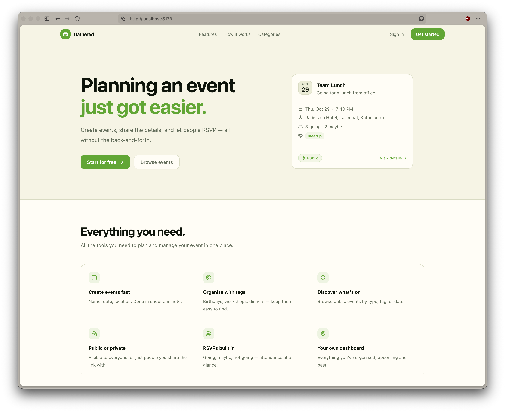
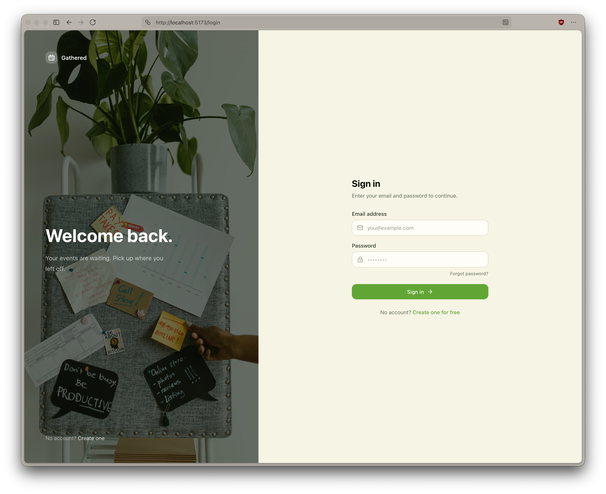
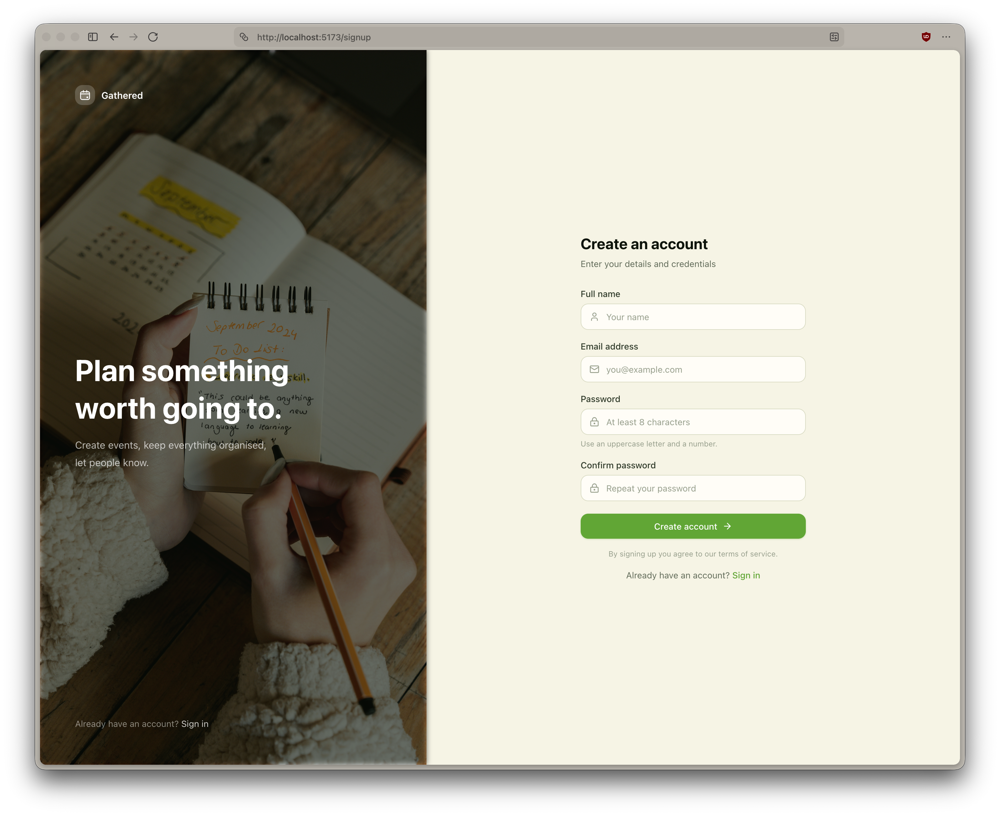
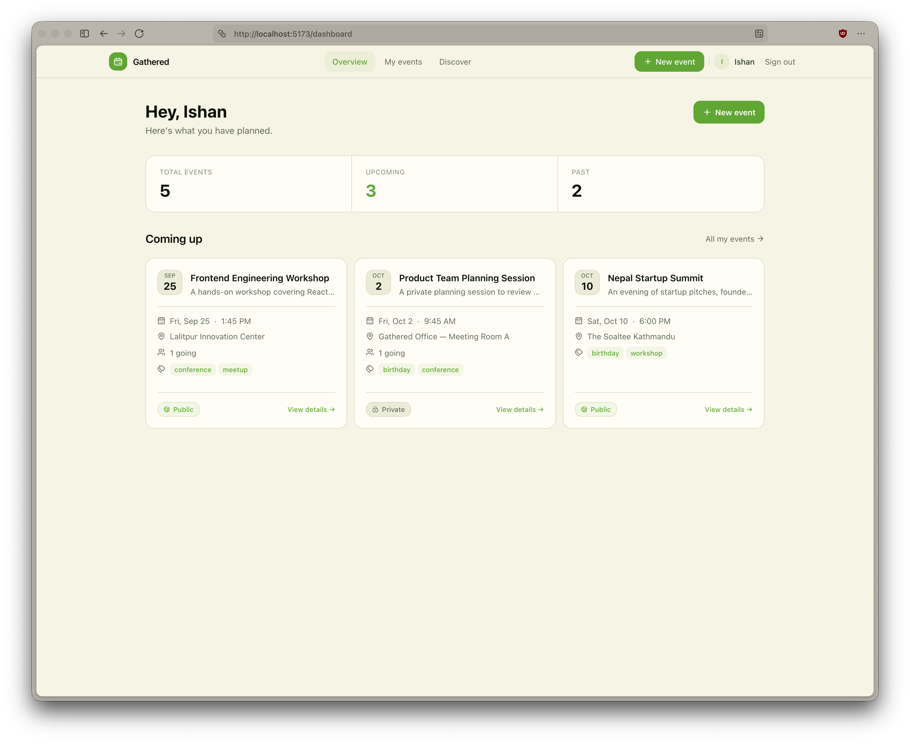
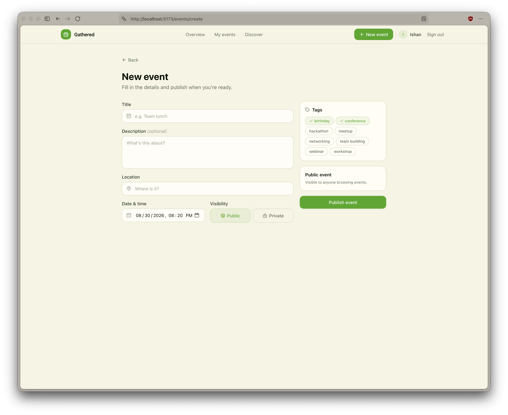
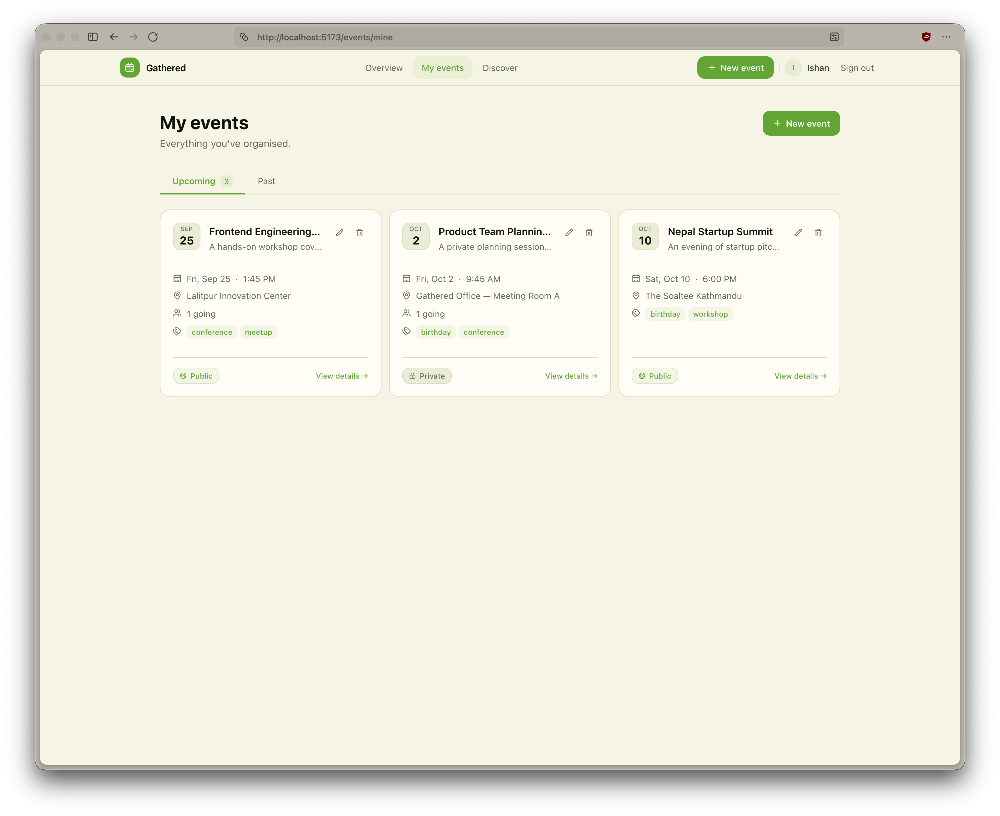
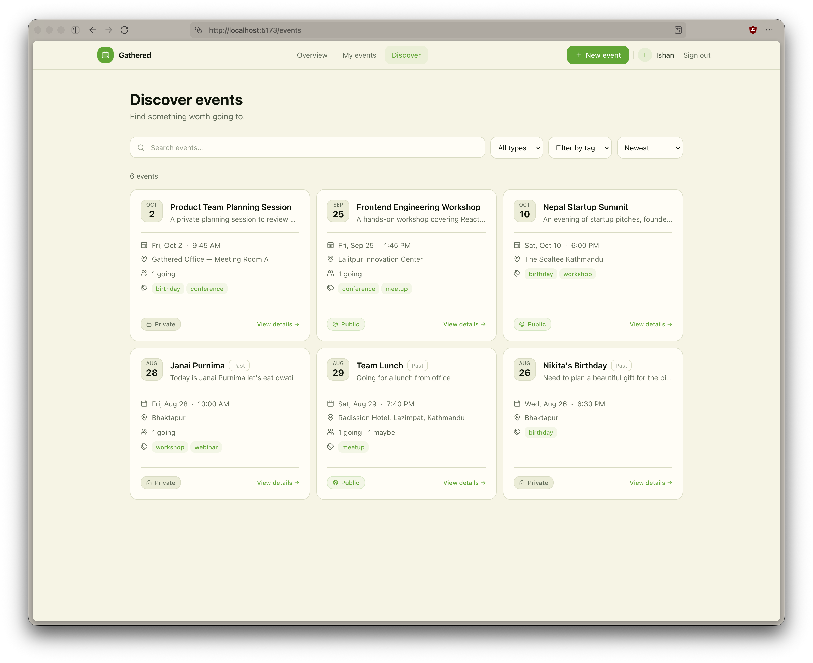
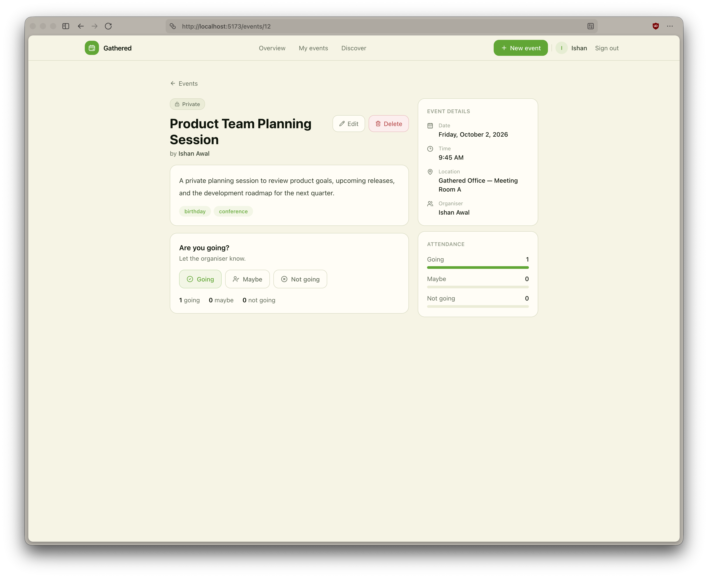
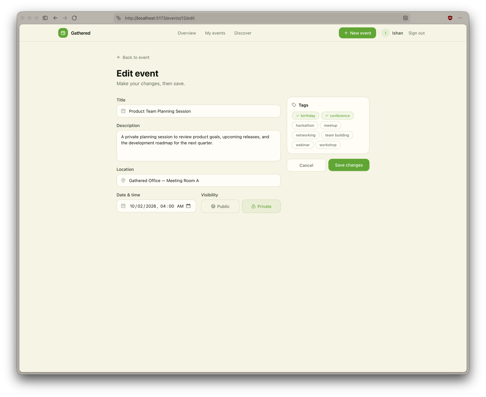

# Event Planning

Event Planning is a full-stack web application that allows users to create events, discover and filter events, view event details, and RSVP to events.

The application is divided into a React frontend and an Express backend, with PostgreSQL used as the database.

### Application URLs

- Frontend: http://localhost:5173
- Backend: http://localhost:4000
- API Documentation: http://localhost:4000/api/docs

---

## 1. Engineering Decisions

### Frontend and Backend Separation

The application is separated into a **React + Vite frontend** and a **Node.js + Express backend**. They communicate through HTTP APIs. This keeps UI logic separate from authentication, validation, business logic, and database operations.

### PostgreSQL + Knex

**PostgreSQL** is used because the application contains relational data such as users, events, tags, and RSVPs. **Knex.js** is used for database queries and migrations, providing direct control over database operations without the additional complexity of a full ORM.

Docker is used only for PostgreSQL, while the frontend and backend run locally for easier development and debugging.

### Backend Architecture

The backend is organized by features such as `auth`, `events`, `tags`, and `rsvps`. Each feature separates routes, controllers, services, and validation where appropriate.

Controllers handle HTTP requests, services contain business logic and database operations, and **Zod** is used to validate request data.

### Authentication

The application uses short-lived **15-minute access tokens** and **7-day refresh tokens**. Access tokens are sent through the `Authorization` header, while refresh tokens are stored in an `httpOnly` cookie and in the database so they can be revoked during logout.

The access token is kept in frontend memory instead of `localStorage` to reduce exposure to XSS attacks. Axios also handles token refresh and retries a failed request once after receiving a `401` response.

### Event Visibility and Authorization

Public events can be viewed without authentication, while private events are only visible to their creator. Creating, editing, deleting, and RSVPing require authentication.

Authorization is enforced on the backend, and only the event owner can edit or delete their event.

### Frontend Structure

The frontend uses **React, TypeScript, Vite, and Zustand**. Pages are kept focused on UI rendering, while data fetching and related logic are handled through view models such as `useEventsViewModel` and `useTagsViewModel`.

Zustand manages authentication state, and Axios is responsible for attaching access tokens and handling token refresh.

### Tag Filtering

When multiple tags are selected, an event must contain **all selected tags** to match the filter. The same matching event IDs are used for both the result list and total count, keeping pagination consistent.

### API Documentation

**Swagger** is available at `/api/docs`, allowing the API endpoints and their request/response formats to be tested independently of the frontend.

---

## 2. Setup Instructions

### Prerequisites

The following software is required:

- Node.js
- npm
- Docker
- Docker Compose

### Step 1: Start the Database

From the project root, run:

```bash
docker compose up -d
```

This starts the PostgreSQL container.

The default database configuration is:

```text
Host: localhost
Port: 5432
User: postgres
Password: postgres
Database: event_planning
```

To stop the database container:

```bash
docker compose down
```

To stop the container and remove the database volume as well:

```bash
docker compose down -v
```

Using `-v` will delete the existing PostgreSQL data.

---

### Step 2: Set Up the Backend

Open a new terminal and run:

```bash
cd backend
cp .env.example .env
npm install
```

Update the `.env` file and set your own values for:

```text
JWT_ACCESS_SECRET
JWT_REFRESH_SECRET
```

Then run the database migrations:

```bash
npm run migrate
```

Seed the database with the initial data:

```bash
npm run seed
```

Finally, start the backend development server:

```bash
npm run dev
```

The backend should now be available at:

```text
http://localhost:4000
```

The health check endpoint can be used to verify that the backend is running:

```text
http://localhost:4000/health
```

The Swagger API documentation is available at:

```text
http://localhost:4000/api/docs
```

---

### Step 3: Set Up the Frontend

Open another terminal and run:

```bash
cd frontend
cp .env.example .env
npm install
npm run dev
```

The frontend should be available at:

```text
http://localhost:5173
```

The frontend `.env` file should contain:

```text
VITE_API_URL=http://localhost:4000/api/v1
```

At this point, the database, backend, and frontend should all be running locally.

---

## 3. Assumptions

The following assumptions were made during development:

- Each event has one owner. The application does not currently support co-hosts or event invitations.
- Private events are visible only to their creator.
- Users must be logged in to create, edit, delete, or RSVP to an event.
- Users can RSVP with `Yes`, `No`, or `Maybe`.
- The application does not currently have a waitlist or maximum attendee limit.
- The Discover Events page is publicly accessible.
- Tags are stored separately and events can have multiple tags.
- Tags can be filtered using their names in a comma-separated format.
- Passwords are hashed before being stored in the database.
- Email verification and password reset functionality are outside the scope of this assessment.
- Events do not currently support cover images or file uploads.
- Docker is used only for the PostgreSQL database in the local development environment.
- The JWT secrets provided in `.env.example` are placeholders and should be replaced with secure values when running the application.
- The application is intended primarily as a local development and assessment project rather than a production deployment.

---

## 4. Screenshots

Screenshots are stored in the `screenshots` directory.

### Landing Page



### Login and Signup





### Dashboard



### Create Event



### My Events



### Discover Events



### Event Details



### Edit Event


